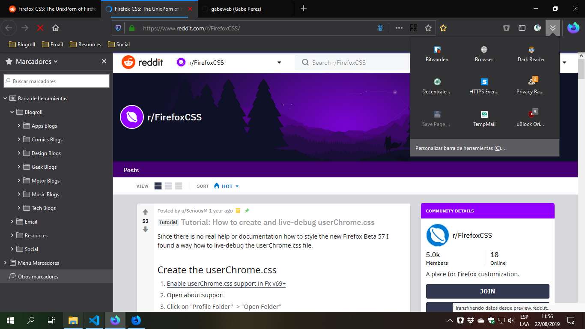
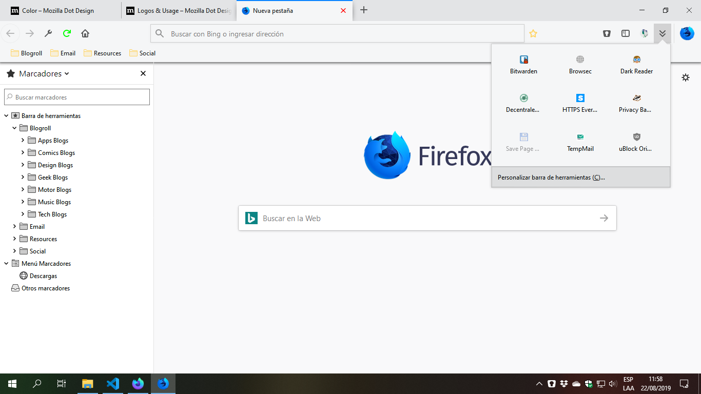

# Firefox-Browser-UI-Custom

A custom userChrome.css and userContent.css for Firefox 68, 69 and 70 (08-2019). For personal purpose only.

(Firefox Browser UI Custom - Firefox Browser 70 - Windows 10)

(Firefox Browser UI Custom - Firefox Quantum 69 - Windows 10)

# Features?

Oh, yes, some little things:

* Contextual menus with (almost) adaptable background color
* Custom fill colors for some icons
* Customized url-bar
* Customized extensions widget panel
* Customized bookmarks popup panel
* Various small custom/fixes for UI

# How-To?

- Copy the [userChrome-70plus.css](https://github.com/gabeweb/Firefox-Browser-UI-Custom/blob/master/userChrome-70plus.css) (for Firefox Browser 70+ version) or [userChrome-up69.css](https://github.com/gabeweb/Firefox-Browser-UI-Custom/blob/master/userChrome-up69.css) (for Firefox Quantum 69) file (right-click -> Save Link As...) to your Firefox profile chrome folder. Rename it as "userChrome.css". Plus, copy the [userContent.css](https://github.com/gabeweb/Firefox-Browser-UI-Custom/blob/master/userContent.css) file too in the same folder.

- Restart Firefox.

These userChrome.css and userContent.css files use code snippets collected from other sources, so the credits (mostly) are for their authors:

* https://github.com/axydavid/FirefoxUI
* https://github.com/gabeweb/Firefox-Quantum-UI-Lite
* https://github.com/muckSponge/MaterialFox
* https://github.com/coekuss/quietfox
* https://github.com/Timvde/UserChrome-Tweaks
* https://www.reddit.com/r/FirefoxCSS/

# Bugs?

Yes, the themes are forks of other projects, so there are many bugs in the code, for example the context menus do not properly reflect the shadows in all environments, nor does the background color of the side panel context menus change (Firefox Browser Nightly 70 "breaks" many things).

I'm not a programmer, but at least I tried to make a new theme for al Firefox users 🤘🏻

Suggestions and ideas are very, very welcome!
