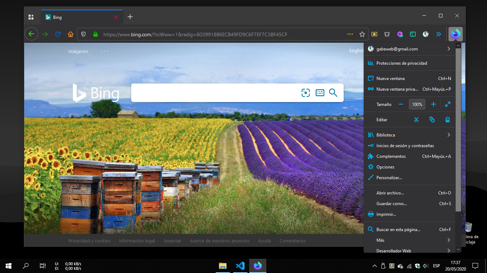
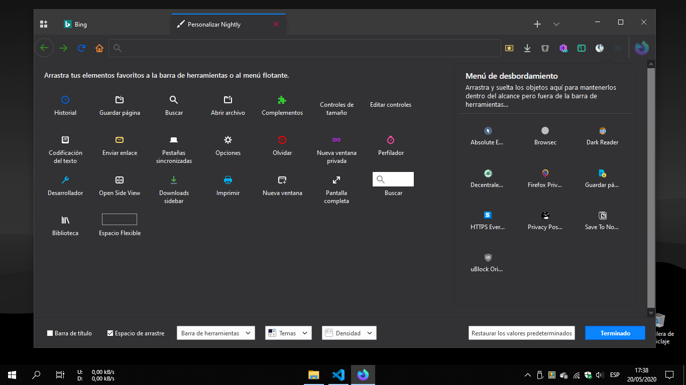
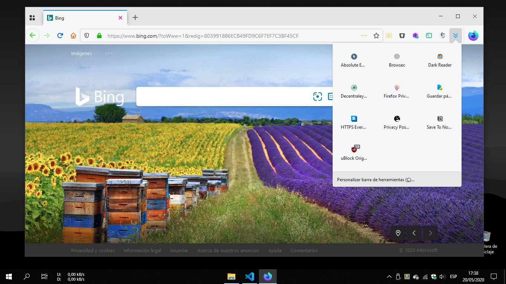
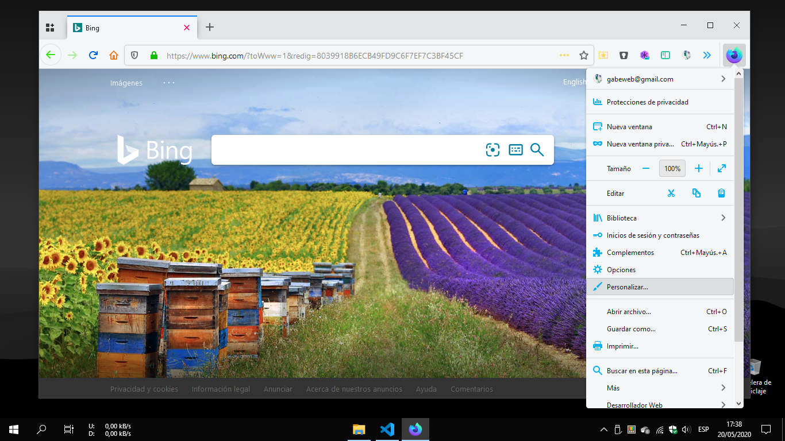
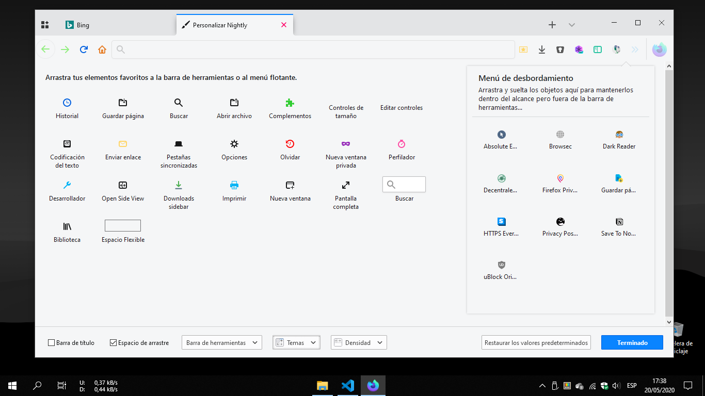

# Firefox-Browser-UI-Custom

A custom userChrome.css and userContent.css now for Firefox 76+ (May 2020). For personal purpose only.

(Firefox Browser UI Custom - Firefox Browser 78 Nigthly - Windows 10 Pro Dark Theme)

(Firefox Browser UI Custom - Firefox Browser 78 Nigthly - Windows 10 Pro Dark Theme)

(Firefox Browser UI Custom - Firefox Browser 78 Nigthly - Windows 10 Pro Dark Theme)

(Firefox Browser UI Custom - Firefox Browser 78 Nigthly - Windows 10 Pro Light Theme)

(Firefox Browser UI Custom - Firefox Browser 78 Nigthly - Windows 10 Pro Light Theme)

(Firefox Browser UI Custom - Firefox Browser 78 Nigthly - Windows 10 Pro Light Theme)

# Features?

Oh, yes, some little things:

* Contextual menus with (almost) adaptable background color
* Custom fill colors for some icons
* Customized url-bar
* Customized extensions widget panel
* Customized bookmarks popup panel
* Various small custom/fixes for UI

# How-To?

- Copy the [userChrome.css](https://github.com/gabeweb/Firefox-Browser-UI-Custom/blob/master/userChrome.css) file (now for Firefox Browser 76+ version) (right-click -> Save Link As...) to your Firefox profile chrome folder. Rename it as "userChrome.css".

- Restart Firefox.

This userChrome.css file use code snippets collected from other sources, so the credits (mostly) are for their authors:

* https://github.com/axydavid/FirefoxUI
* https://github.com/gabeweb/Firefox-Quantum-UI-Lite
* https://github.com/muckSponge/MaterialFox
* https://github.com/coekuss/quietfox
* https://github.com/Timvde/UserChrome-Tweaks
* https://www.reddit.com/r/FirefoxCSS/

# Bugs?

Yes, the themes are forks of other projects, so there are many bugs in the code, for example the context menus do not properly reflect the shadows in all environments, nor does the background color of the side panel context menus change (Firefox Browser Nightly 78 "breaks" some things).

I'm not a programmer, but at least I tried to make a new theme for al Firefox users 🤘🏻

Suggestions and ideas are very, very welcome!
